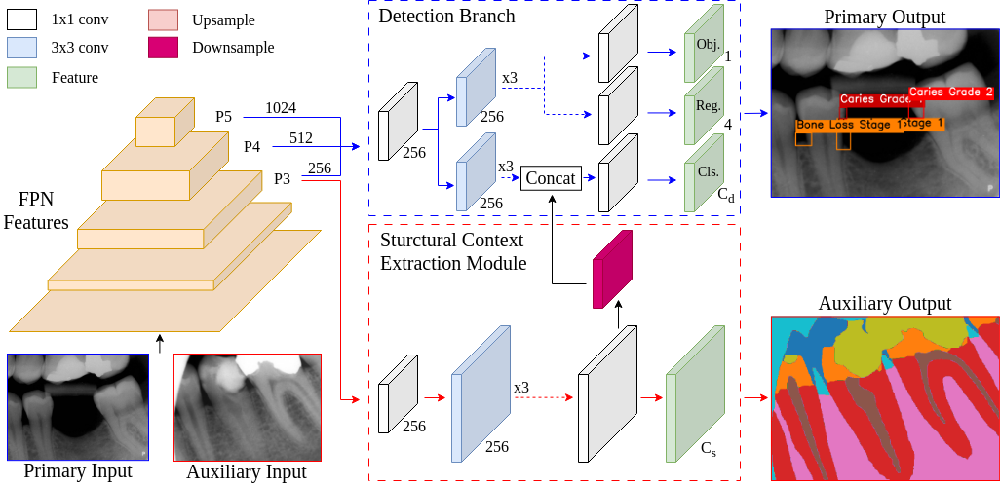

# DentalX: Context-aware Dental Disease Detection
[ISBI 2026](https://biomedicalimaging.org/2026) | [Proceeding](?) | 
[](https://arxiv.org/abs/2601.08797)

## Description
Diagnosing dental diseases from radiographs is time-consuming and challenging due to the subtle nature of diagnostic evidence. Existing methods, which rely on object detection models designed for natural images with more distinct target patterns, struggle to detect dental diseases that present with far less visual support. To address this challenge, we propose DentalX, a novel context-aware dental disease detection approach that leverages oral structure information to mitigate the visual ambiguity inherent in radiographs. Specifically, we introduce a structural context extraction module that learns an auxiliary task: dental anatomy semantic segmentation. The module extracts meaningful structural context and integrates it into the primary disease detection task to enhance the detection of subtle dental diseases. 

<p align="center">Figure 1: Overview of the proposed DentalX. The structural context extraction module introduces the auxiliary dental anatomy segmentation task and extracts useful structural information to improve dental disease detection. DentalX jointly learns both tasks from partially annotated data by computing loss value only when the corresponding ground truth label is present.
</p><p align="center"></p>


## Setup Environment
Disclaimer: The codes have only been tested on Ubuntu 22.04, Python 3.8.20 and Pytorch 1.7.1 CUDA 11.0, but they should work on environments with similar major versions.
1. Install required libraries by running 
    ```bash
    conda create -n dentalx python=3.8
    conda activate dentalx
    pip install torch==1.7.1+cu110 torchvision==0.8.2+cu110 torchaudio==0.7.2 -f https://download.pytorch.org/whl/torch_stable.html
    pip install -r requirements.txt
    pip install -v -e .
    ```

2. Download pretrained model weights (optional)
    ```bash
    mkdir pretrained_weights
    cd pretrained_weights
    wget https://github.com/Megvii-BaseDetection/YOLOX/releases/download/0.1.1rc0/yolox_l.pth
    cd ..
    ```

## Bring your datasets
1. Ensure your detection dataset is in COCO format. The dataset folder should have the following structure:
   ```
    coco
    ├── annotations
    │   ├── instances_train2017.json
    │   ├── instances_val2017.json
    │   ├── instances_test2017.json
    ├── train2017
    ├── val2017
    ├── test2017
   ```
2. Ensure your segmentation dataset is in COCO Stuff10k format. The dataset folder should have the following structure:
   ```
    coco_stuff10k
    ├── images
    │   ├── train2014
    │   ├── test2014
    ├── annotations
    │   ├── train2014
    │   ├── test2014
    ├── imagesLists
    │   ├── train.txt
    │   ├── test.txt
    │   ├── all.txt
   ```
3. Update the following configuration in `exps/default/dentalx.py`
   - `self.num_classes`: number of classes in detection task
   - `self.data_dir`: path to the `coco` dataset folder
   - `self.semantic_num_classes`: number of classes in segmentation task
   - `self.semantic_train_image_dir`: path to the `coco_stuff10k/images/train2014` folder
   - `self.semantic_train_ann_dir`: path to the `coco_stuff10k/annotations/train2014` folder
   - `self.semantic_test_image_dir`: path to the `coco_stuff10k/images/test2014` folder
   - `self.semantic_test_ann_dir`: path to the `coco_stuff10k/annotations/test2014` folder

## How to run
Run the scripts with `--help` argument to see arguments descriptions.
The following example trains our proposed model with the default configuration:
```bash
python tools/train.py -f exps/default/dentalx.py -d 1 -b 8 --fp16 -o -c pretrained_weights/yolox_l.pth \
    --logger wandb wandb-project <project_name>
```
To train the detection only model (YOLOX):
```bash
python tools/train.py -f exps/default/yolox_l.py -d 1 -b 16 --fp16 -o -c pretrained_weights/yolox_l.pth \
    --logger wandb wandb-project <project_name>
```

All experiments metrics are logged to Tensorboard and WandB. They can be disabled by excluding the `--logger` argument.

## Results
| Detection Method                                                                                                              | AP$^{.5}$ | AP$^{.75}$ | AP$^{.5:.95}$ | Inference FPS |
|-------------------------------------------------------------------------------------------------------------------------------|-----------|------------|---------------|---------------|
| [Faster R-CNN](https://pytorch.org/vision/main/models/generated/torchvision.models.detection.fasterrcnn_resnet50_fpn_v2.html) | 34.2      | 8.1        | 13.9          | 17            |
| [YOLOX](https://github.com/Megvii-BaseDetection/YOLOX)                                                                        | 40.7      | 13.0       | 18.1          | **191**       |
| [DINO](https://github.com/IDEA-Research/DINO)                                                                                 | 43.3      | 15.6       | 20.5          | 20            |
| DentalX (ours)                                                                                                                | **45.9**  | **17.1**   | **21.0**      | 180           |

The segmentation baselines are implemented with [mmsegmentation](https://github.com/open-mmlab/mmsegmentation) library.

| Segmentation Method                                                                                                          | mIoU     | mDice    | mAcc     |
|------------------------------------------------------------------------------------------------------------------------------|----------|----------|----------|
| [UNet](https://github.com/open-mmlab/mmsegmentation/blob/main/configs/unet/unet-s5-d16_fcn_4xb4-160k_cityscapes-512x1024.py) | 81.2     | 89.5     | 90.3     |
| [SETR](https://github.com/open-mmlab/mmsegmentation/blob/main/configs/setr/setr_vit-l_naive_8xb2-160k_ade20k-512x512.py)     | 84.7     | 91.5     | 91.1     |
| [PIDNet](https://github.com/open-mmlab/mmsegmentation/blob/main/configs/pidnet/pidnet-l_2xb6-120k_1024x1024-cityscapes.py)   | 82.8     | 90.5     | 92.2     |
| DentalX (ours)                                                                                                               | **86.3** | **92.5** | **94.2** |

## Acknowledgement
This work is developed based on the codebase of [YOLOX](https://github.com/Megvii-BaseDetection/YOLOX). We thank the authors for releasing their source code and models.
